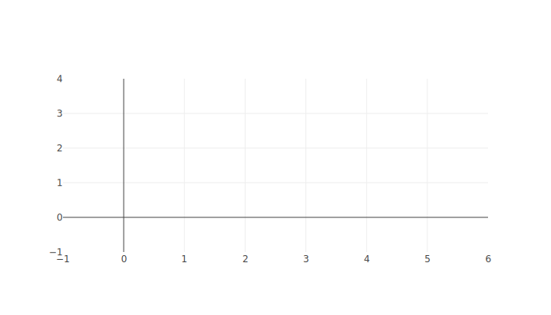

# Frequently asked questions: troubleshooting

## I am not getting an image file, what went wrong?

In case of any errors, the server will respond with an HTTP status code other
than 200 OK (e.g. 400 Bad Request) and a short plain text message containing the
reason for the error.

## The server responds with "Post data is not valid JSON!", but I have posted only JSON. How can that be?

Note that there are some subtle differences between objects specified directly
in JavaScript and valid JSON. For example, the plot data that could be specified
in a JavaScript code snippet as

```js
var data = [
  {
    x: ['2013-10-04 22:23:00', '2013-11-04 22:23:00', '2013-12-04 22:23:00'],
    y: [1, 3, 6],
    type: 'scatter'
  }
];

Plotly.newPlot('myDiv', data);
```

corresponds to the following JSON to generate the same plot on the export
server:

```json
{
  "x": ["2013-10-04 22:23:00", "2013-11-04 22:23:00", "2013-12-04 22:23:00"],
  "y": [1, 3, 6],
  "type": "scatter"
}
```

The notable differences are:

* no array brackets around the data (an array is not an object in the sense of
  JavaScript _Object_ Notation)
* no single quote string delimiters, only double quotes are valid string
  delimiters in JSON
* names of object members in JSON have to be enclosed in double quotes, too,
  e.g. _y: [1,3,6]_ becomes _"y": [1,3,6]_

## Can I also include layout information in my request?

Yes. Just specify `data` and `layout` as separate members of the `POST`ed JSON.
For example, the following JSON uses the `layout.title` member to set a title
for the generated plot:

```json
{
  "data": [
    {
      "x": ["2013-10-04 22:23:00", "2013-11-04 22:23:00", "2013-12-04 22:23:00"],
      "y": [1, 3, 6],
      "type": "scatter"
    }
  ],
  "layout": {
    "title": "Example title"
  }
}
```

## The image I get just contains axis but no plot data. Why?

If the image looks something like this, ...



... then it is due to the fact that the specified plot data is not the way that
Plotly.js expects it to be. In other words, there is in error in the specified
data. (The export server does not detect such mistakes, because it only checks
whether the data is valid JSON.) The simplest case would be that the data is
just empty, and therefore nothing is rendered. You might want to check the
[Ploty examples](https://plot.ly/javascript/) to get an idea what data Plotly.js
requires to render certain kinds of plots. Playing around with the plot data on
[CodePen](https://codepen.io/plotly/pen/b2233edcd3d97500db0a2ade7b2cbdf0) might
also be a way to figure out the correct data format.
