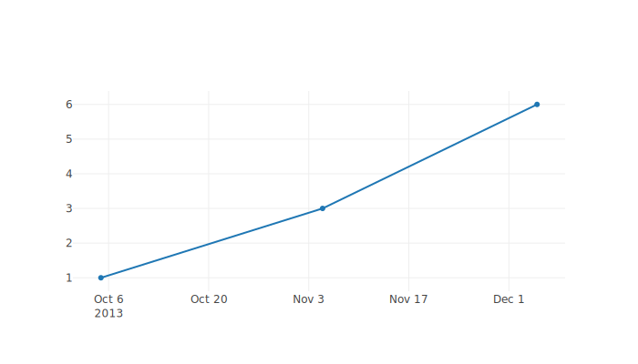
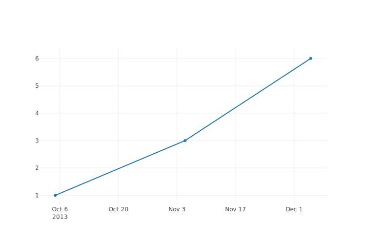

# Node.js server for offline export of Plotly.js graphs

This repository contains a Node.js application that starts a server which can
render [Plotly.js](https://plotly.com/javascript/) graphs to PNG images
__without sending the data to the servers of Plotly__. That means all plot data
stays on this local server and is NOT sent over the net. If you value the
privacy of your data, this might be a better option for you than using the API
on the Plotly servers.

## Requirements

This application needs one prerequisite:

* Node.js 14 or later (preferably the latest LTS version)

### Installation of Node.js

The installation of Node.js is covered in a [separate document](./documentation/installation-node-js.md).

_(If you prefer a setup within a Docker container over a native installation,
then please take a look at [Setup with Docker](./documentation/docker.md).)_

## Initial setup: install Node.js dependency packages

The application requires a package for `jsdom`. To install that, type

    npm install

in the directory `export-server/`. You only need to do this once. The packages
are then cached in the `node_modules/` directory for future use.

## Start the application

You can simply start the application via

    npm start

which fires up the Node.js application. The server will then listen on
<http://localhost:3000/> for incoming connections.

If you want the server to listen on a different port, then you can set the
environment variable `PORT` accordingly. On Linux-like systems you can do

``` bash
export PORT=4000
npm start
```

The equivalent on Windows command prompt would be

``` cmd
SET PORT=4000
npm start
```

In these cases the server will bind to port 4000 instead of the default port
3000.

The hostname can be changed, too, by setting the `HOST` environment variable in
the same manner, e. g.:

``` bash
export HOST=0.0.0.0
npm start
```

If `HOST` is not set, then `localhost` will be used as hostname.

## Usage

To generate a PNG file of a Plotly plot, just send an HTTP POST request to the
running Node.js server on <http://localhost:3000/> containing the data for the
plot as JSON in its body.

For example, POSTing the following JSON code to the server

    {
      "x": ["2013-10-04 22:23:00", "2013-11-04 22:23:00", "2013-12-04 22:23:00"],
      "y": [1, 3, 6],
      "type": "scatter"
    }

will generate a JSON response like e.g.:

    {
      "success": true,
      "filename": "graph-007e94ad-97c7-4f7b-9bf1-a524f689b8b5.svg"
    }

The field _filename_ in the response indicates the location of the generated
image file on the server. In the example above you could then get the image from
<http://localhost:3000/graph-67294429-8620-4d4c-a63e-74727c6a4418.svg>. Given
the data above the image would look like this:



### Adjusting the width and height of the generated image

The generated SVG image has a width of 700 pixels and a height of 400 pixels by
default. If no size is specified, then the image will be of that default size.
However, this may not always be suitable for your needs.

To change the size, add the HTTP headers `X-Image-Width` and / or
`X-Image-Height` to the request. Acceptable values are integers only, the values
will be interpreted as pixels, not centimetres, inches or other. For example, if
you want the image to be 750 x 500 pixels, then set the HTTP headers

    X-Image-Width: 750
    X-Image-Height: 500

Using the same JSON as above, the created image will now be slightly larger and
look like this:



## Troubleshooting

If you encounter problems while trying to generate a plot image, then please
take a look at [the FAQ](./documentation/troubleshooting-faq.md). Some common
errors and possible solutions are listed there.

## Version history

A version history is available in [changelog.md](./changelog.md).

## Copyright and Licensing

Copyright 2018, 2020, 2021, 2022  Dirk Stolle

This program is free software: you can redistribute it and/or modify
it under the terms of the GNU General Public License as published by
the Free Software Foundation, either version 3 of the License, or
(at your option) any later version.

This program is distributed in the hope that it will be useful,
but WITHOUT ANY WARRANTY; without even the implied warranty of
MERCHANTABILITY or FITNESS FOR A PARTICULAR PURPOSE.  See the
GNU General Public License for more details.

You should have received a copy of the GNU General Public License
along with this program.  If not, see <http://www.gnu.org/licenses/>.
